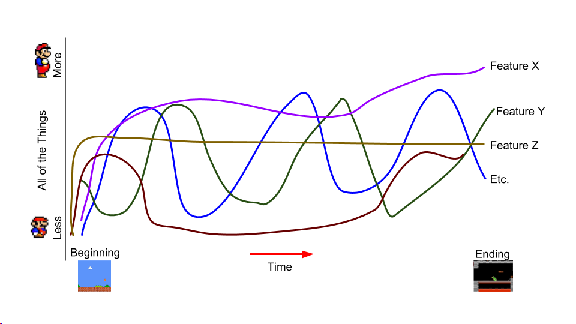

[Projects](index.html) | [About Me](bio.html) | [CV](CV.html) 

# Explaining Search by Analogy with Videogame Moments

  

  
  

  
   
  
  

  
   

  
   
  
  

  
  

**Summary:** An interactive explanation of the concept of search by analogy, with an emphasis on searching for moments within video games.

**Process:** A previous project resulted in defining video game moments as vectors. 
Existing work exploring vector analogies in text inspired us to explore the potential of this kind of work for our video game moments. 
Given promising initial results, we decided to develop a tool to facilitate further search, and to test the concept in several other domains. 

**Technology:** This project was prototyped in Python and then ported to Javascript for public consumption.

**Outcomes:** The explainer will be available online. A test version is [here.](http://barrettrees.com/search_by_analogy_interactive/IntroductionToSearchByAnalogy.html)

There is a slightly older version of the widget [here.](http://barrettrees.com/analogy_javascript_test.html)

