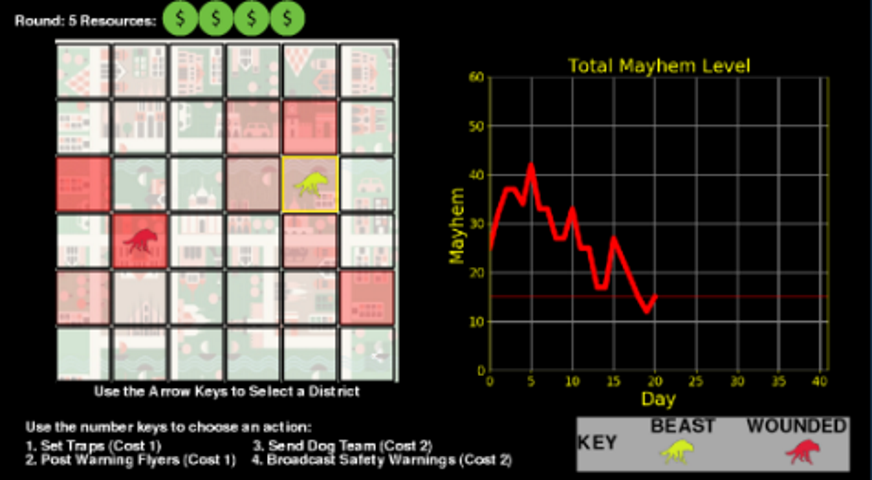
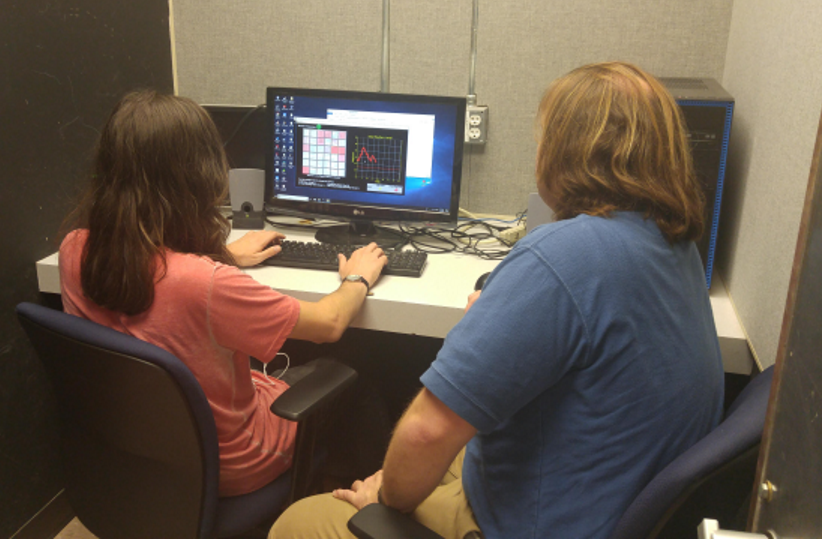

[Projects](index.html) | [About Me](bio.html) | [CV](CV.html) 

# Crime Metaphor Game

*With [Chris Karzmark](https://www.researchgate.net/scientific-contributions/2143158450_Christopher_R_Karzmark)*

  

  
  

  
   
  
  

  
   

  
   
  
  

  
  

**Summary:** An abstract strategy game about crime, created for an experiment to test the psychological reality of procedural rhetoric.

**Process:** There is a genre of games that have been created for persuasive/rhetorical purposes. 
While game scholars have provided a theoretical framework for understanding how these games convey their messages,
in contrast with explicitly educational games there has been little empirical research on how effective they are at doing so. 
To facilitate research filling this gap I created a rhetorical game based in part on previous studies of learning from metaphor and analogy.
Creating a novel game for research purposes has three main advantages over using an existing game: the ease with which the game can be
varied to test effect of specific aspects, the addition of built-in data collection facilities, and the ability to share our game 
freely with other researchers. The game was inspired by both previous psychological research and knowledge of existing games, 
improved by the process of critique and pilot testing, and ultimately evaluated in the context of other persuasive games. 

**Technology:** The game was built in [Python](https://www.python.org/), using [Pygame](https://www.pygame.org) and assets from the [Noun Project](https://thenounproject.com/) 
and [Freesound](https://freesound.org/). Survey data was collected with [Google Forms](https://docs.google.com/forms) and analyzed using [Python](https://www.python.org/), [R](https://www.r-project.org/), and [SPSS](https://www.ibm.com/analytics/spss-statistics-software).

**Outcomes:** Participants who played the game identified it as rhetorical, and were able to identify some specific arguments they felt the game was making. Consistent with other persuasive games, participants did not report any shift in their behavior or values. The results of [an initial study of procedural rhetoric] (https://barrettrees.com/papers/Anderson%20Karzmark%20Wardrip-Fruin%202019%20The%20Psychological%20Reality%20of%20Procedural%20Rhetoric.pdf) will be presented at the 14th International Conference on the Foundations of Digital Games. A follow-up experiment tested the effectiveness of several variations of this game, and a manuscript describing findings from this study is in preparation.

