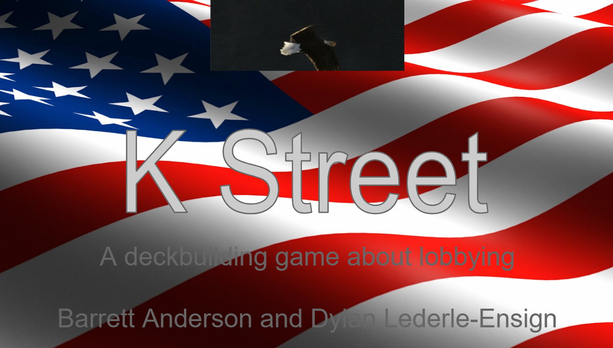

[Projects](index.html) | [About Me](bio.html) | [CV](CV.html) 

# K Street Card Game

  

  
  

  
   
  
  

  
   

  
   
  
  

    
   

  
   
  
  

    
   

  
   
  
  

  
  

  

**Summary:** A deckbuilding cardgame with a political lobbying theme and a bluffing mechanic.

**Process:** The game was created for a playable media course at UCSC in Winter 2015, and was improved over several rounds of criticique and playtesting. We chose a modern political theme in reaction the common science fiction and fantasy themes in the majority of deckbuilding games avaialable at the time. This theme guided us to experiment with a bluffing mechanic, which resulted in more counterplay and player interaction.

**Technology:** Cards were prototyped with [nanDeck](http://www.nand.it/nandeck/).

**Outcomes:** The game instructions are available [here](http://barrettrees.com/K Street Instructions.pdf), and a 
print-and-play prototype deck [here.](http://barrettrees.com/K Street Deck.pdf)

