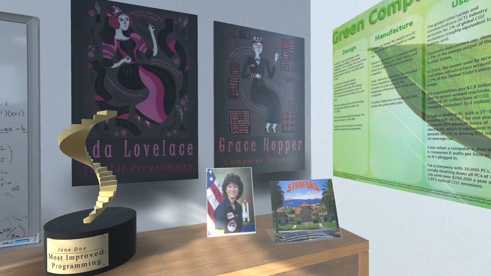
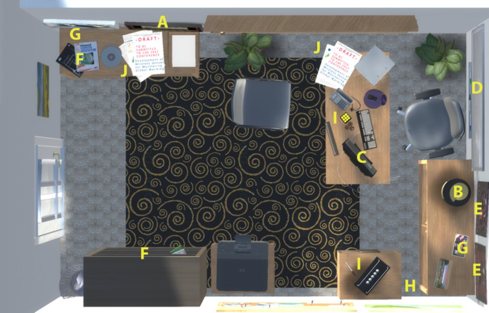

[About Me](index.html) | [Projects](projects.html) | [CV](CV.html) 

# STEM VR Office 
*With [Christy Starr](https://www.researchgate.net/profile/Christine_Starr) and [Katie Green](http://www.katieagreen.com/)*

  

  
  

  
   
  
  

  
   

  
   
  
  

  
   

  
   
  
  

  
  

**Summary:** This was a VR game designed to encourage women's interest in STEM fields in the context of a psychological experiment.

**Process:** We created a VR office, and asked participants to explore the space while imagining that it belonged to their future self. This office was filled with various signs of success (a graduate degree, awards, works-in-progress,etc.), and customized with the participant's name. There were two variations, one presenting a successful future in STEM and one presenting a successful future in the humanities. 

**Technology:** The virtual environment was created in [Unity](https://unity3d.com/) and presented with an [HTC Vive](https://www.vive.com) virtual reality headset. Surveys were presented via [psychsurveys.org](https://www.psychsurveys.org/) and analyzed using [R](https://www.r-project.org/) and [SPSS](https://www.ibm.com/analytics/spss-statistics-software).

**Outcomes:** Participants who imagined a successful future self in the VR STEM environment reported greater feelings of belong and confidence in STEM fields. This work resulted in a presentation at the Media Preconference for the 8th Confererence of the Society for the Study of Emerging Adulthood in Washington, D.C. a presentation at the 4th Annual Gender & STEM Network Conference, in Eugene, O.R, and a [publication](https://barrettrees.com/papers/Starr%20Anderson%20Green%202019%20Virtual%20Reality%20Experience%20Influences%20Stereotype%20Threat%20and%20STEM%20Motivation%20Among%20Undergraduate%20Women.pdf) in the Journal of Science Education and Technology.

