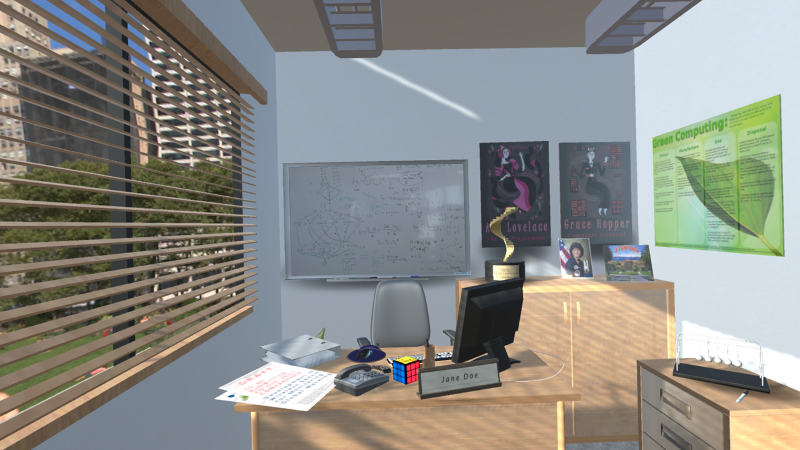

[Projects](index.html) | [About Me](bio.html) | [CV](CV.html) 

# Projects

  
  

  
  Searching for moments in a game, based on their relationships to other moments.
  
  

  
  

  
  
  
  

  
  Testing the psychological reality of procedural rhetoric with a game about crime.
  
  

  
  
 
 

  
  A VR study encouraging women's interest and confidence in STEM fields.
  
  

  
  
 
 

  
  *Designed w/ Dylan Lederle-Ensign*
  A deck-building card game about political lobbying.
  
  

