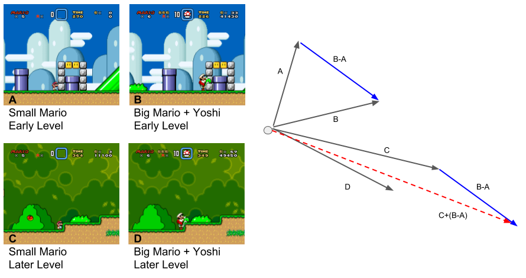
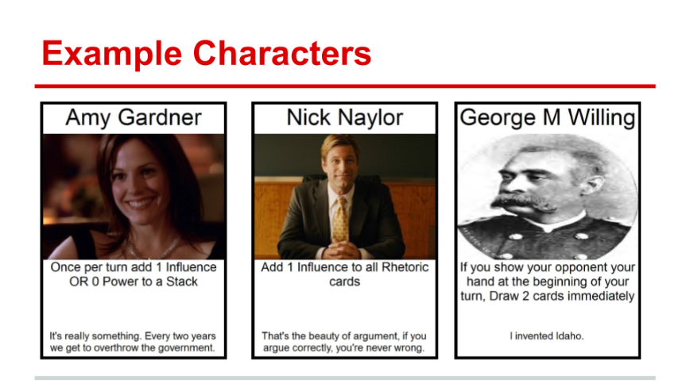

[Projects](index.html) | [About Me](bio.html) | [CV](CV.html) 

# Projects

  
  
  
  

  
  A new way of searching for moments in a game, based on their relationships to other moments. This project is an explainer for the underlying concept, which has applications in other domains.
  
  

  
  
  
  

  
  A game designed to convey a simplified model of the relationship between crime and law enforcement. Created as part of an experiment testing the psychological reality of procedural rhetoric.
  
  

  
  
 
 

  
  A VR study encouraging women's interest and confidence in STEM fields.
  
  

  
  
 
 

  
  A deck-building card game about political lobbying. Senators and scandals instead of orcs and spells. Includes a bluffing mechanic! Educational and ~~upsetting~~ fun!
  
  

## Explaining Search by Analogy for Videogame Moments
 A new way of searching for moments in a game, based on their relationships to other moments. This project is an explainer for the underlying concept, which has applications in other domains.

## Crime Metaphor Game

A game designed to convey a simplified model of the relationship between crime and law enforcement. Created as part of an experiment testing the psychological reality of procedural rhetoric.

## K Street 

*Designed w/ Dylan Lederle-Ensign*

A deck-building card game about political lobbying. Senators and scandals instead of orcs and spells. Includes a bluffing mechanic! Educational and ~~upsetting~~ fun!
